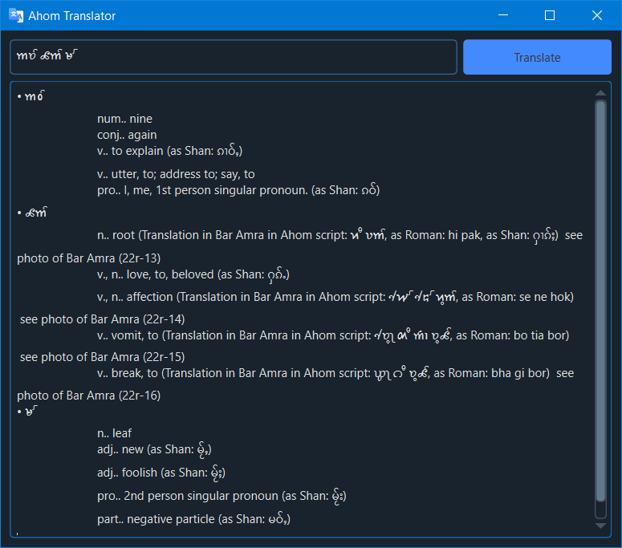

<h1 align='center'>  Ahom Translator</h1>
<p align='center'>
    <br>
    A Simple Ahom Translator with PyQT6 & BeautifulSoup4
</p>

## Synopsis

Enter any text in Ahom script (unicode) and the app will give meaning of all the words at once

## Installation

Install the [requirements](#requirements)
```bash
pip install PySide6
pip install BeautifulSoup
pip install qdarkstyle
pip install requests
```

